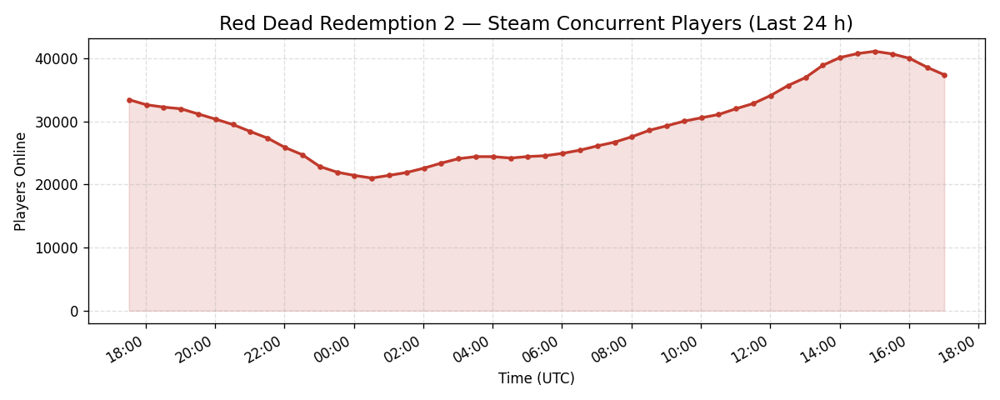

# RDR2 Steam Player Tracker

A cloud-based data pipeline that tracks Red Dead Redemption 2 concurrent Steam players every 30 minutes and exposes the data through a REST API.

## Background

This project tracks the number of concurrent Steam players for Red Dead Redemption 2 (Steam app ID `1174180`) over time. Player counts follow clear daily and weekly rhythms, making this an ideal time-series dataset. The goal is to surface those patterns through a live API and auto-generated plot.

## Architecture

```
EventBridge (rate 30 min)
    └─> Ingest Lambda (ingest/lambda_function.py)
            └─> Steam API (ISteamUserStats/GetNumberOfCurrentPlayers)
            └─> DynamoDB (rdr2-player-counts)

API Gateway
    └─> Chalice Lambda (rdr2-tracker/app.py)
            ├─> GET /         → project description + resource list
            ├─> GET /current  → latest player count
            ├─> GET /trend    → 24-hour avg / peak / low / delta
            └─> GET /plot     → renders chart → uploads to S3 → returns URL
```

## Example Plot

